# TubeQuery 🎥 - Chat with YouTube Videos 

TubeQuery is an AI-powered tool that allows users to "chat" with any YouTube video. By pasting a URL, the application extracts the transcript, processes it using **DeepSeek V4 Flash**, and allows users to ask questions about the video content in real-time.

## 🚀 Features
* **Instant Transcript Extraction:** Fetches video text automatically without downloading the video.
* **Context-Aware Chat:** Uses RAG (Retrieval Augmented Generation) to answer questions based *only* on the video's actual content.
* **Powered by DeepSeek V4 Flash:** Served through OpenCode's OpenAI-compatible endpoint, so swapping models is a one-line `.env` change.
* **Real Conversational Memory:** Follow-ups like "what about the second one?" are rewritten into standalone queries before retrieval, so context actually carries between turns.
* **Source Citations:** The system is grounded in the specific video provided, reducing hallucinations.

## 🛠️ Tech Stack
* **Language:** Python 3.9+
* **Frontend:** Streamlit
* **LLM:** DeepSeek V4 Flash (via OpenCode, OpenAI-compatible API)
* **Embeddings:** FastEmbed / `BAAI/bge-small-en-v1.5` — runs locally via ONNX (~50MB, no API key, no torch)
* **Vector Database:** FAISS (Facebook AI Similarity Search)
* **Orchestration:** LangChain
* **Data Source:** YouTube Transcript API

## ⚙️ Setup & Run Guide

### Prerequisites
1.  Python installed on your machine.
2.  An OpenCode API key with access to DeepSeek V4 Flash.

### Installation Steps

1.  **Clone the repository (or download files):**
    ```bash
    git clone <your-repo-link>
    cd TubeQuery
    ```

2.  **Create a virtual environment:**
    ```bash
    python -m venv venv
    # Windows:
    venv\Scripts\activate
    # Mac/Linux:
    source venv/bin/activate
    ```

3.  **Install dependencies:**
    ```bash
    pip install -r requirements.txt
    ```

4.  **Set up Environment Variables:**
    * Copy `.env.example` to `.env` and fill it in:
        ```text
        OPENCODE_API_KEY=your_opencode_api_key_here
        OPENCODE_BASE_URL=https://opencode.ai/zen/v1
        MODEL_NAME=deepseek-v4-flash
        ```
    * The embedding model needs no key — it downloads once on first run.
    * **Note on the base URL:** it must end at `/v1`. The OpenAI SDK appends
      `/chat/completions` itself — including it yourself produces a 404.
    * **Note on models:** `deepseek-v4-flash` requires credits on your OpenCode
      workspace. `GET https://opencode.ai/zen/v1/models` lists what's available;
      switching is a one-line `MODEL_NAME` change, no code edit.

5.  **Run the Application:**
    ```bash
    streamlit run app.py
    ```

## 🏗️ System Architecture

```mermaid
flowchart LR
    subgraph IDX["INDEXING · once per video"]
        direction LR
        URL["YouTube URL"] -->|fetch captions| API["youtube-transcript-api"]
        API -->|raw transcript| SPLIT["RecursiveCharacterTextSplitter<br/><i>1000 chars · 100 overlap</i>"]
        SPLIT -->|chunks| EMB["FastEmbed · bge-small-en-v1.5<br/><i>local ONNX · no API key</i>"]
    end

    EMB -->|vectors| DB[("FAISS<br/>Vector Store")]

    subgraph QRY["QUERY · per message"]
        direction LR
        Q["User Question"] --> RW["History-Aware Rewriter<br/><i>follow-up → standalone query</i>"]
        RW --> SEARCH["Similarity Search<br/><i>k = 4</i>"]
        SEARCH -->|"question + chunks"| LLM["DeepSeek V4 Flash<br/><i>via OpenCode · OpenAI-compatible</i>"]
        LLM --> ANS["Grounded Answer"]
    end

    DB -.->|retrieve| SEARCH
    HIST["Chat History"] -.-> RW
    HIST -.-> LLM
    ANS -.->|append| HIST

    classDef local fill:#0f766e,stroke:#134e4a,color:#fff
    classDef cloud fill:#b45309,stroke:#78350f,color:#fff
    classDef store fill:#334155,stroke:#0f172a,color:#fff
    class EMB,SPLIT,API local
    class LLM cloud
    class DB,HIST store
```



*Everything except the DeepSeek call runs locally — embeddings never leave the machine.*

1.  **Input:** User provides a YouTube URL.
2.  **Extraction:** `YouTubeTranscriptApi` fetches the subtitles.
3.  **Processing:** LangChain `RecursiveCharacterTextSplitter` breaks the text into manageable chunks (1000 characters).
4.  **Embedding:** Chunks are converted into vectors locally using `FastEmbedEmbeddings`.
5.  **Storage:** Vectors are stored locally in a `FAISS` index for efficient similarity search.
6.  **Retrieval:** The follow-up question is first rewritten into a standalone query using the chat history, then the system finds the 4 most relevant chunks.
7.  **Generation:** The relevant chunks + chat history + the question are sent to **DeepSeek V4 Flash** to generate a natural language answer.

## 📊 Impact & Metrics
* **Efficiency:** Reduces video consumption time by allowing users to query specific details (e.g., "What was the conclusion?") instantly.
* **Cost:** Retrieval sends only the ~4 most relevant chunks to the LLM instead of the whole transcript, so token cost stays flat regardless of video length.
* **Accuracy:** By using a low temperature (0.2) and strict context injection, the model provides factual answers derived strictly from the source.

## ☁️ Deployment (Streamlit Community Cloud)

Streamlit needs a long-lived process holding a WebSocket open, so it cannot run on
serverless hosts like Vercel. Streamlit Community Cloud is free and purpose-built:

1.  Push this repo to GitHub.
2.  At [share.streamlit.io](https://share.streamlit.io), pick the repo and `app.py`.
3.  Under **Advanced settings → Secrets**, paste (TOML, not `.env` syntax):
    ```toml
    OPENCODE_API_KEY = "your_opencode_api_key_here"
    OPENCODE_BASE_URL = "https://opencode.ai/zen/v1"
    MODEL_NAME = "deepseek-v4-flash"
    ```

The same `app.py` runs unchanged on macOS/Windows localhost and in the cloud.

## ✅ Tests
```bash
python test_tubequery.py   # no API key needed
```

## 🔮 What's Next (Limitations & Future Work)
* **Current Limitation:** Only works on videos that have enabled closed captions/subtitles.
* **Current Limitation:** YouTube rate-limits datacenter IPs, so transcript fetches can intermittently fail when deployed (they are reliable from a home/laptop IP). Workaround is a proxy.
* **Current Limitation:** The FAISS index lives in `st.session_state`, so it is rebuilt per browser session and lost on app restart.
* **Future Improvement:** Implement Whisper AI for audio-to-text to support videos without subtitles.
* **Future Improvement:** Add support for processing entire playlists or multiple videos at once.